# Project Documentation

This repository contains data for various projects.

## Microsoft Flight Simulator 2020

This section lists the aircraft and their available instruments.

| Name | Image | Instruments |
|------|-------|-------------|
| Airbus A320 Fenix | <a href="././msfs2020/airbus_a320_fenix/plane.png">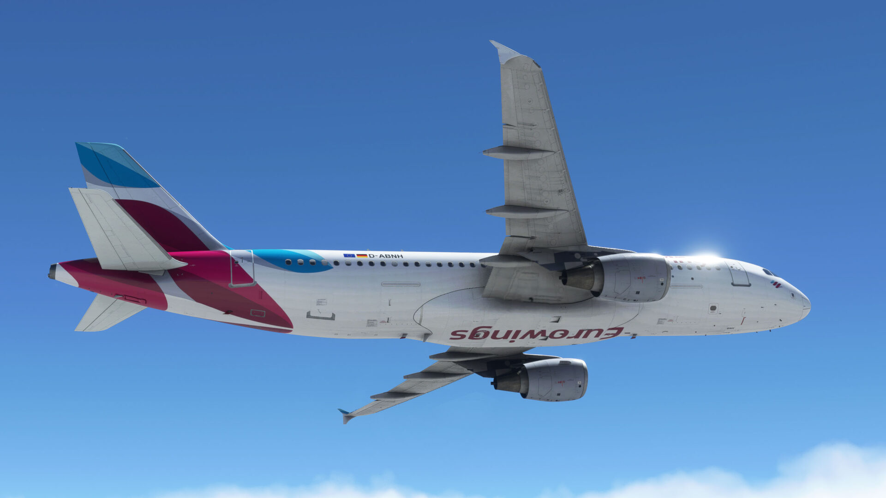</a> | [Mcdu](./msfs2020/airbus_a320_fenix/mcdu/mcdu.siff) |
| Airbus A320 Flybywire |  | [Fms](./msfs2020/airbus_a320_flybywire/fms/fms.siff) |
| Beechcraft Bonanza Brsimdesigns | <a href="././msfs2020/beechcraft_bonanza_brsimdesigns/plane.png">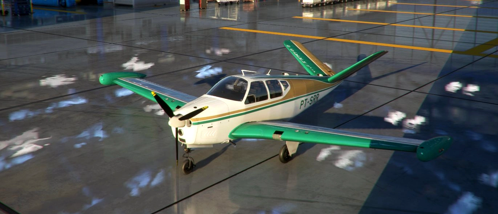</a> | [Fuel Selector Valve](./msfs2020/beechcraft_bonanza_brsimdesigns/fuel_selector_valve/fuel_selector_valve.siff) |
| Beechcraft Bonanza Default | <a href="././msfs2020/beechcraft_bonanza_default/plane.png">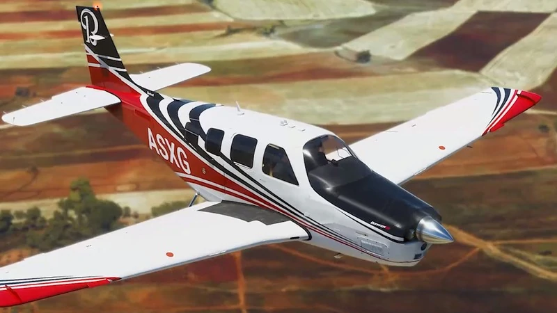</a> | [Fuel Selector Valve](./msfs2020/beechcraft_bonanza_default/fuel_selector_valve/fuel_selector_valve.siff) [Switch Panel](./msfs2020/beechcraft_bonanza_default/switch_panel/switch_panel.siff) |
| Bombardier Crj Default |  | [Pedestal Eicas Panel](./msfs2020/bombardier_crj_default/pedestal_eicas_panel/pedestal_eicas_panel.siff) [Pedestal Cargo Firex Panel](./msfs2020/bombardier_crj_default/pedestal_cargo_firex_panel/pedestal_cargo_firex_panel.siff) [Pedestal Atc Transponder Panel](./msfs2020/bombardier_crj_default/pedestal_atc_transponder_panel/pedestal_atc_transponder_panel.siff) [Overhead Apu Panel](./msfs2020/bombardier_crj_default/overhead_apu_panel/overhead_apu_panel.siff) [Pedestal Lighting Control Panel](./msfs2020/bombardier_crj_default/pedestal_lighting_control_panel/pedestal_lighting_control_panel.siff) [Pedestal Audio Control Panel](./msfs2020/bombardier_crj_default/pedestal_audio_control_panel/pedestal_audio_control_panel.siff) [Parking Brake](./msfs2020/bombardier_crj_default/parking_brake/parking_brake.siff) [Pedestal Fan Selector Panel](./msfs2020/bombardier_crj_default/pedestal_fan_selector_panel/pedestal_fan_selector_panel.siff) [Landing Gear Control Panel](./msfs2020/bombardier_crj_default/landing_gear_control_panel/landing_gear_control_panel.siff) [Pedestal Weather Radar System Panel](./msfs2020/bombardier_crj_default/pedestal_weather_radar_system_panel/pedestal_weather_radar_system_panel.siff) [Pedestal Blank Panel](./msfs2020/bombardier_crj_default/pedestal_blank_panel/pedestal_blank_panel.siff) [Pedestal Intercom Control Panel](./msfs2020/bombardier_crj_default/pedestal_intercom_control_panel/pedestal_intercom_control_panel.siff) [Overhead Hydraulic Sov Panel](./msfs2020/bombardier_crj_default/overhead_hydraulic_sov_panel/overhead_hydraulic_sov_panel.siff) [Overhead Ignition Panel](./msfs2020/bombardier_crj_default/overhead_ignition_panel/overhead_ignition_panel.siff) [Pedestal Stabmach Trim Panel](./msfs2020/bombardier_crj_default/pedestal_stabmach_trim_panel/pedestal_stabmach_trim_panel.siff) [Pedestal Source Selector Panel](./msfs2020/bombardier_crj_default/pedestal_source_selector_panel/pedestal_source_selector_panel.siff) [Fms Mcdu Overlay](./msfs2020/bombardier_crj_default/fms_mcdu_overlay/fms_mcdu_overlay.siff) [Overhead Bleed Air Panel](./msfs2020/bombardier_crj_default/overhead_bleed_air_panel/overhead_bleed_air_panel.siff) [Overhead Anti Ice Panel](./msfs2020/bombardier_crj_default/overhead_anti_ice_panel/overhead_anti_ice_panel.siff) [Overhead Landing Lights Panel](./msfs2020/bombardier_crj_default/overhead_landing_lights_panel/overhead_landing_lights_panel.siff) [Warning Light Panel](./msfs2020/bombardier_crj_default/warning_light_panel/warning_light_panel.siff) [Pedestal Aileron Rudder Trim Panel](./msfs2020/bombardier_crj_default/pedestal_aileron_rudder_trim_panel/pedestal_aileron_rudder_trim_panel.siff) [Overhead Fire Test Panel](./msfs2020/bombardier_crj_default/overhead_fire_test_panel/overhead_fire_test_panel.siff) [Pedestal Radio Tuning Unit](./msfs2020/bombardier_crj_default/pedestal_radio_tuning_unit/pedestal_radio_tuning_unit.siff) [Engine Miscellaneous Test Panel](./msfs2020/bombardier_crj_default/engine_miscellaneous_test_panel/engine_miscellaneous_test_panel.siff) [Overhead Cabin Pressure Panel](./msfs2020/bombardier_crj_default/overhead_cabin_press_panel/overhead_cabin_pressure_panel.siff) [Overhead Hydraulic Switches Panel](./msfs2020/bombardier_crj_default/overhead_hydraulic_switches_panel/overhead_hydraulic_switches_panel.siff) [Overhead Misc Lights Panel](./msfs2020/bombardier_crj_default/overhead_misc_lights_panel/overhead_misc_lights_panel.siff) [Ground Proximity Warning Panel](./msfs2020/bombardier_crj_default/ground_proximity_warning_panel/ground_proximity_warning_panel.siff) [Overhead Electrical Power Panel](./msfs2020/bombardier_crj_default/overhead_electrical_power_panel/overhead_electrical_power_panel.siff) [Pedestal Flight Desk Door Panel](./msfs2020/bombardier_crj_default/pedestal_flight_desk_door_panel/pedestal_flight_desk_door_panel.siff) [Bombardier  Overhead Pass Emer Lights And Elt Panel](./msfs2020/bombardier_crj_default/overhead_pass_&_emer_lights_and_elt_panel/bombardier__overhead_pass_emer_lights_and_elt_panel.siff) [Pedestal Hgs Control Panel](./msfs2020/bombardier_crj_default/pedestal_hgs_control_panel/pedestal_hgs_control_panel.siff) [Spoilers Switch Panel](./msfs2020/bombardier_crj_default/spoilers_switch_panel/spoilers_switch_panel.siff) [Autopilot](./msfs2020/bombardier_crj_default/afcs_autopilot/autopilot.siff) [Overhead Air Conditioning Panel](./msfs2020/bombardier_crj_default/overhead_air_conditioning_panel/overhead_air_conditioning_panel.siff) [Pedestal Irs Mode Panel](./msfs2020/bombardier_crj_default/pedestal_irs_mode_panel/pedestal_irs_mode_panel.siff) [Pdf Mdf Overlay Bezel](./msfs2020/bombardier_crj_default/pfd_mfd_overlay_bezel/pdf_mdf_overlay_bezel.siff) [Side Panel](./msfs2020/bombardier_crj_default/side_panel/side_panel.siff) [Overhead External Lights Panel](./msfs2020/bombardier_crj_default/overhead_external_light_panel/overhead_external_lights_panel.siff) [Pedestal Yaw Damper Panel](./msfs2020/bombardier_crj_default/pedestal_yaw_damper_panel/pedestal_yaw_damper_panel.siff) [Overhead Fuel Panel](./msfs2020/bombardier_crj_default/overhead_fuel_panel/overhead_fuel_panel.siff) |
| Cessna 152 Default | <a href="././msfs2020/cessna_152_default/plane.png">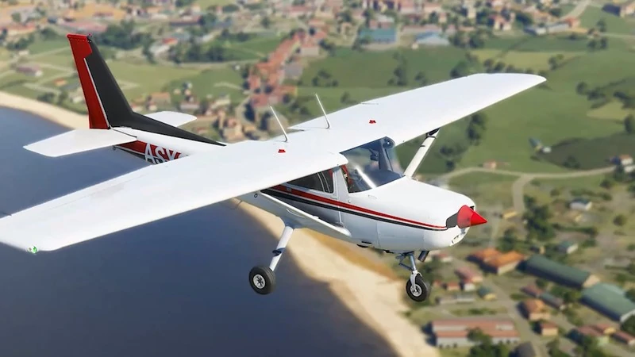</a> | [Cessna 152 Fuel Valve](./msfs2020/cessna_152_default/cessna_152_fuel_valve/cessna_152_fuel_valve.siff) [C152   Caburator Heat](./msfs2020/cessna_152_default/cessna_152_carb_heat/c152___caburator_heat.siff) [Cessna 152 Primer Handle](./msfs2020/cessna_152_default/cessna_152_primer_handle/cessna_152_primer_handle.siff) |
| Cessna 172 Default |  | [Cessna 172 Alternate Static Air](./msfs2020/cessna_172_default/cessna_172_alternate_static_air/cessna_172_alternate_static_air.siff) [Cessna 172   Fuel Cutoff](./msfs2020/cessna_172_default/cessna_172_fuel_cutoff_valve/cessna_172___fuel_cutoff.siff) [Cessna 172 G1000   Switch Panel ](./msfs2020/cessna_172_default/cessna_172_g1000_switch_panel/cessna_172_g1000___switch_panel_.siff) |
| Cessna 310 Milviz | <a href="././msfs2020/cessna_310_milviz/plane.png">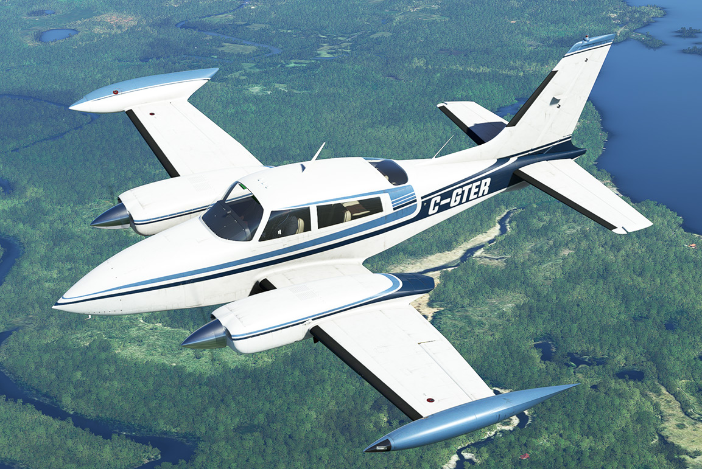</a> | [Cessna 310 (Milviz)   Fuel Quantity Gauge](./msfs2020/cessna_310_milviz/fuel_gauge/cessna_310_(milviz)___fuel_quantity_gauge.siff) [Cessna 310 (Milviz)   Heat And Cabin Air](./msfs2020/cessna_310_milviz/heat_and_cabin_air/cessna_310_(milviz)___heat_and_cabin_air.siff) [Cessna 310 (Milviz)   Fuel Selector](./msfs2020/cessna_310_milviz/fuel_selector/cessna_310_(milviz)___fuel_selector.siff) [Cessna 310 (Milviz)   Edm Overlay](./msfs2020/cessna_310_milviz/edm/cessna_310_(milviz)___edm_overlay.siff) [Cessna 310 (Milviz)   Light And De Ice Switch Panel](./msfs2020/cessna_310_milviz/deice_and_exterior_light_panel/cessna_310_(milviz)___light_and_de_ice_switch_panel.siff) [Cessna 310 (Milviz)   Fuel Flow Meter](./msfs2020/cessna_310_milviz/fuel_flow_meter/cessna_310_(milviz)___fuel_flow_meter.siff) [Cessna 310 (Milviz)   Main Switch Panel](./msfs2020/cessna_310_milviz/electrical_panel/cessna_310_(milviz)___main_switch_panel.siff) |
| Cessna 414 Flysimware | <a href="././msfs2020/cessna_414_flysimware/plane.png">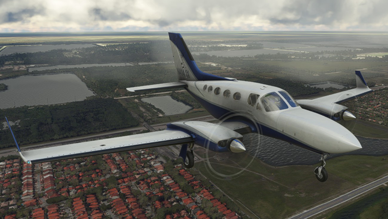</a> | [Cessna 414Aw (Fsw)   Exhaust Gas Temperature Gauge](./msfs2020/cessna_414_flysimware/egt/cessna_414aw_(fsw)___exhaust_gas_temperature_gauge.siff) [Cessna 414Aw (Fsw)   Fuel Quantity Gauge](./msfs2020/cessna_414_flysimware/fuel_quantity/cessna_414aw_(fsw)___fuel_quantity_gauge.siff) [Cessna 414Aw (Fsw)   Cabin Differential Pressure](./msfs2020/cessna_414_flysimware/cabin_differential_pressure/cessna_414aw_(fsw)___cabin_differential_pressure.siff) [Cessna 414Aw (Fsw)   Radar Altimeter](./msfs2020/cessna_414_flysimware/radar_alt/cessna_414aw_(fsw)___radar_altimeter.siff) [Cessna 414Aw (Fsw)   Digital Altitude Alerter](./msfs2020/cessna_414_flysimware/digital_altitude_alerter/cessna_414aw_(fsw)___digital_altitude_alerter.siff) [Cessna 414Aw (Fsw)   Climate Control   Air Conditioning](./msfs2020/cessna_414_flysimware/climate_control_air_conditioner/cessna_414aw_(fsw)___climate_control___air_conditioning.siff) [Cessna 414Aw (Fsw)   Cowl Flaps](./msfs2020/cessna_414_flysimware/cowl_flaps/cessna_414aw_(fsw)___cowl_flaps.siff) [Cessna 414Aw (Fsw)   Altimeter ](./msfs2020/cessna_414_flysimware/altimeter/cessna_414aw_(fsw)___altimeter_.siff) [Cessna 414Aw (Fsw)   Vertical Speed Indicator ](./msfs2020/cessna_414_flysimware/vsi/cessna_414aw_(fsw)___vertical_speed_indicator_.siff) [Cessna 414Aw (Fsw)   Aileron Trim](./msfs2020/cessna_414_flysimware/aileron_trim/cessna_414aw_(fsw)___aileron_trim.siff) [Cessna 414 (Fsw)   Fuel Selector](./msfs2020/cessna_414_flysimware/fuel_selector_valves/cessna_414_(fsw)___fuel_selector.siff) [Cessna 414Aw (Fsw)   Cabin Pressurization Control](./msfs2020/cessna_414_flysimware/cabin_pressure_control/cessna_414aw_(fsw)___cabin_pressurization_control.siff) [Cessna 414Aw (Fsw)   Turn And Slip Coordinator](./msfs2020/cessna_414_flysimware/turn/cessna_414aw_(fsw)___turn_and_slip_coordinator.siff) [Cessna 414Aw (Fsw)   Interior Light Panel](./msfs2020/cessna_414_flysimware/interior_lighting/cessna_414aw_(fsw)___interior_light_panel.siff) [Cessna 414Aw (Fsw)   Suction Gauge](./msfs2020/cessna_414_flysimware/suction/cessna_414aw_(fsw)___suction_gauge.siff) [Cessna 414Aw (Fsw)   Manifold Pressure Gauge](./msfs2020/cessna_414_flysimware/manifold/cessna_414aw_(fsw)___manifold_pressure_gauge.siff) [Cessna 414Aw (Fsw)   Oat Gauge](./msfs2020/cessna_414_flysimware/oat/cessna_414aw_(fsw)___oat_gauge.siff) [Cessna 414Aw (Fsw)   Garmin Gfc 600 Overlay](./msfs2020/cessna_414_flysimware/gfc_600/cessna_414aw_(fsw)___garmin_gfc_600_overlay.siff) [Cessna 414 (Fsw)   Altitude Alerter](./msfs2020/cessna_414_flysimware/altitude_alerter/cessna_414_(fsw)___altitude_alerter.siff) [Cessna 414Aw (Fsw)   Annunciator Panel](./msfs2020/cessna_414_flysimware/annunciator_panel/cessna_414aw_(fsw)___annunciator_panel.siff) [Cessna 414 (Fsw)   Annunciator Panel](./msfs2020/cessna_414_flysimware/annunciator_panel/cessna_414_(fsw)___annunciator_panel.siff) [Cessna 414Aw (Fsw)   Cabin Pressure Switch](./msfs2020/cessna_414_flysimware/cabin_pressure_switch/cessna_414aw_(fsw)___cabin_pressure_switch.siff) [Cessna 414Aw (Fsw)   Climate Control   Heating](./msfs2020/cessna_414_flysimware/climate_control_heater/cessna_414aw_(fsw)___climate_control___heating.siff) [Cessna 414Aw (Fsw)   Switch Panel](./msfs2020/cessna_414_flysimware/switch_panel/cessna_414aw_(fsw)___switch_panel.siff) [Cessna 414Aw (Fsw)   Cabin Pressurization Rate](./msfs2020/cessna_414_flysimware/cabin_rate/cessna_414aw_(fsw)___cabin_pressurization_rate.siff) [Cessna 414Aw (Fsw)   Pressure Dump And Oxygen Levers](./msfs2020/cessna_414_flysimware/pressure_dump/cessna_414aw_(fsw)___pressure_dump_and_oxygen_levers.siff) [Cessna 414Aw (Fsw)   Rpm Gauge](./msfs2020/cessna_414_flysimware/rpm/cessna_414aw_(fsw)___rpm_gauge.siff) [Cessna 414Aw (Fsw)   Airspeed Indicator](./msfs2020/cessna_414_flysimware/airspeed_indicator/cessna_414aw_(fsw)___airspeed_indicator.siff) [Cessna 414Aw (Fsw)   Cabin Oxygen Capacity](./msfs2020/cessna_414_flysimware/cabin_oxygen_capacity/cessna_414aw_(fsw)___cabin_oxygen_capacity.siff) [Cessna 414Aw (Fsw)   Triple Gauge](./msfs2020/cessna_414_flysimware/triple/cessna_414aw_(fsw)___triple_gauge.siff) |
| Cessna Citation Cj4 | <a href="././msfs2020/cessna_citation_cj4/plane.png">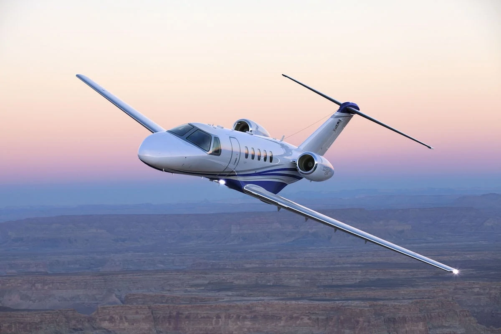</a> | [Cessna Citation Cj4 Audio Panel](./msfs2020/cessna_citation_cj4/cj4_audio_panel/cessna_citation_cj4_audio_panel.siff) [Cessna Citation Cj4 Climate Control Knob](./msfs2020/cessna_citation_cj4/cj4_climate_control_knob/cessna_citation_cj4_climate_control_knob.siff) [Cessna Citation Cj4 Standby Flight Instrument Overlay](./msfs2020/cessna_citation_cj4/cj4_standby_flight_instrument/cessna_citation_cj4_standby_flight_instrument_overlay.siff) [Cessna Citation Cj4 Lower Ccp Panel](./msfs2020/cessna_citation_cj4/cj4_lower_ccp_panel/cessna_citation_cj4_lower_ccp_panel.siff) [Cessna Citation Cj4 Pfd Mfd Overlay](./msfs2020/cessna_citation_cj4/cj4_pfd_mfd_overlay/cessna_citation_cj4_pfd_mfd_overlay.siff) [Cessna Citation Cj4 Autopilot Panel](./msfs2020/cessna_citation_cj4/cj4_autopilot_panel/cessna_citation_cj4_autopilot_panel.siff) [Cessna Citation Cj4 Light Panel](./msfs2020/cessna_citation_cj4/cj4_light_panel/cessna_citation_cj4_light_panel.siff) [Cessna Citation Cj4 Landing Gear Handle](./msfs2020/cessna_citation_cj4/cj4_landing_gear_handle/cessna_citation_cj4_landing_gear_handle.siff) [Cessna Citation Cj4 Ice Protection Panel](./msfs2020/cessna_citation_cj4/cj4_ice_protection_panel/cessna_citation_cj4_ice_protection_panel.siff) [Cessna Citation Cj4 Fuel Transfer Knob](./msfs2020/cessna_citation_cj4/cj4_fuel_transfer_knob/cessna_citation_cj4_fuel_transfer_knob.siff) [Cessna Citation Cj4 Parking Brake](./msfs2020/cessna_citation_cj4/cj4_parking_brake/cessna_citation_cj4_parking_brake.siff) [Cessna Citation Cj4 Electrical Panel](./msfs2020/cessna_citation_cj4/cj4_electrical_panel/cessna_citation_cj4_electrical_panel.siff) [Cessna Citation Cj4 Master Caution And Warning](./msfs2020/cessna_citation_cj4/cj4_master_caution_warning/cessna_citation_cj4_master_caution_and_warning.siff) [Cessna Citation Cj4 Cockpit Lights](./msfs2020/cessna_citation_cj4/cj4_cockpit_lights/cessna_citation_cj4_cockpit_lights.siff) [Cessna Citation Cj4 Rockwell Collins Pro Line 21 Fms Mcdu Overlay](./msfs2020/cessna_citation_cj4/cj4_rockwell_collins_pro_line_21/cessna_citation_cj4_rockwell_collins_pro_line_21_fms_mcdu_overlay.siff) [Cessna Citation Cj4 Upper Dcp Menu](./msfs2020/cessna_citation_cj4/cj4_upper_dcp_panel/cessna_citation_cj4_upper_dcp_menu.siff) [Cessna Citation Cj4 Trim And Engine Control Panel](./msfs2020/cessna_citation_cj4/cj4_trim_and_engine_control/cessna_citation_cj4_trim_and_engine_control_panel.siff) |
| Cirrus Sr22 Default |  | [Cirrus Sr22   Switch Panel](./msfs2020/cirrus_sr22_default/switch_panel/cirrus_sr22___switch_panel.siff) |
| Cirrus Visionjet Flightfx | <a href="././msfs2020/cirrus_visionjet_flightfx/plane.png">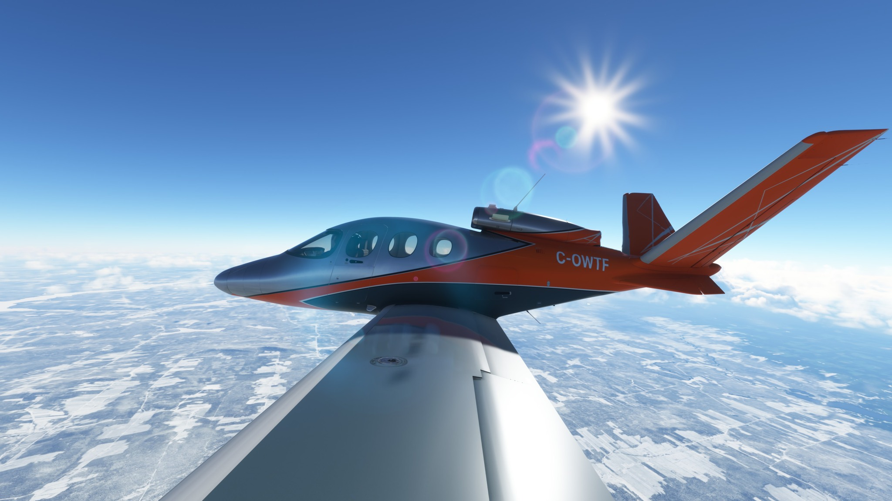</a> | [Cirrus Sf50 Vision Jet (Flightfx)   Fuel Selector](./msfs2020/cirrus_visionjet_flightfx/fuel_selector/cirrus_sf50_vision_jet_(flightfx)___fuel_selector.siff) [Cirrus Sf50 Vision Jet (Flightfx)   Evironmental Control System](./msfs2020/cirrus_visionjet_flightfx/ecs/cirrus_sf50_vision_jet_(flightfx)___evironmental_control_system.siff) [Cirrus Sf50 Vision Jet (Flightfx)   Flap Actuator](./msfs2020/cirrus_visionjet_flightfx/flap_actuator/cirrus_sf50_vision_jet_(flightfx)___flap_actuator.siff) [Cirrus Sf50 Vision Jet (Flightfx)   Landing Gear Panel](./msfs2020/cirrus_visionjet_flightfx/landing_gear/cirrus_sf50_vision_jet_(flightfx)___landing_gear_panel.siff) [Cirrus Sf50 Vision Jet (Flightfx)   Start Controls](./msfs2020/cirrus_visionjet_flightfx/start_control/cirrus_sf50_vision_jet_(flightfx)___start_controls.siff) [Cirrus Sf50 Vision Jet (Flightfx)   Auto Throttle](./msfs2020/cirrus_visionjet_flightfx/auto_throttle/cirrus_sf50_vision_jet_(flightfx)___auto_throttle.siff) [Cirrus Sf50 Vision Jet (Flightfx)   Switch Panel ](./msfs2020/cirrus_visionjet_flightfx/switch_panel/cirrus_sf50_vision_jet_(flightfx)___switch_panel_.siff) |
| Daher Kodiak Simworks | <a href="././msfs2020/daher_kodiak_simworks/plane.png">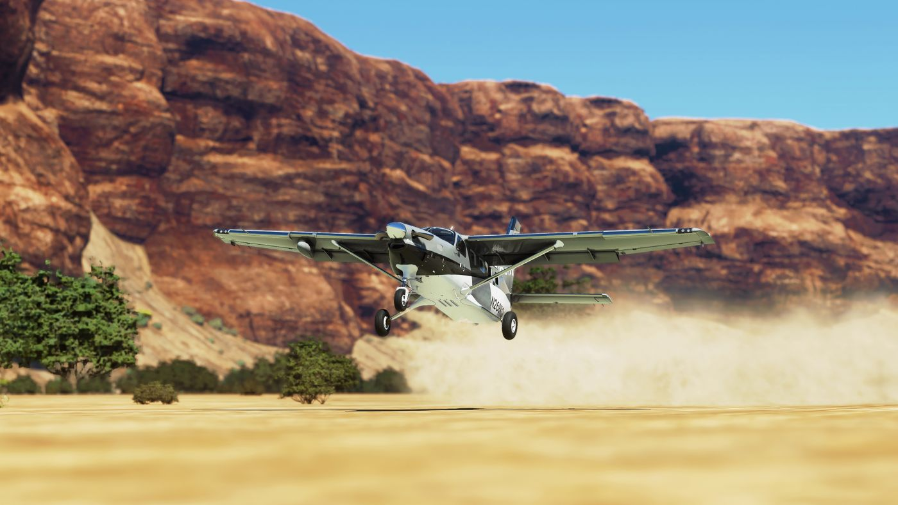</a> | [Daher Kodiak (Sws)   Light And Ice Switch Panel](./msfs2020/daher_kodiak_simworks/dakher_kodiak_light_and_ice_panel/daher_kodiak_(sws)___light_and_ice_switch_panel.siff) [Daher Kodiak (Sws)   Rudder Trim Switch](./msfs2020/daher_kodiak_simworks/daher_kodiak_rudder_trim_switch/daher_kodiak_(sws)___rudder_trim_switch.siff) [Daher Kodiak (Sws)   Fuel Valves](./msfs2020/daher_kodiak_simworks/daher_kodiak_fuel_valves/daher_kodiak_(sws)___fuel_valves.siff) [Daher Kodiak (Sws)   Oxygen Control Panel](./msfs2020/daher_kodiak_simworks/daher_kodiak_oxygen_control/daher_kodiak_(sws)___oxygen_control_panel.siff) [Daher Kodiak (Sws)   Switch Panel](./msfs2020/daher_kodiak_simworks/dakher_kodiak_switch_panel/daher_kodiak_(sws)___switch_panel.siff) [Daher Kodiak (Sws)   Shoulder Harness Reel Lock Lever](./msfs2020/daher_kodiak_simworks/daher_kodiak_shoulder_harness_lock_lever/daher_kodiak_(sws)___shoulder_harness_reel_lock_lever.siff) |
| Generic | <a href="././msfs2020/generic/plane.png">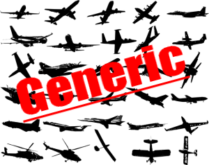</a> | [Generic   Gtc 570 Bezel Overlay](./msfs2020/generic/generic_garmin_gtc570/generic___gtc_570_bezel_overlay.siff) [Generic   Hobbs Meter](./msfs2020/generic/generic_hobbs_meter/generic___hobbs_meter.siff) [Generic Garmin Gmc 710](./msfs2020/generic/generic_garmin_gmc_710/generic_garmin_gmc_710.siff) [Generic   Garmin Gfc 500 Autopilot ](./msfs2020/generic/generic_gfc500/generic___garmin_gfc_500_autopilot_.siff) [Generic   Tdi Simulations Garmin Gtnxi 650 Overlay](./msfs2020/generic/generic_tds_gtnxi_650/generic___tdi_simulations_garmin_gtnxi_650_overlay.siff) [Generic   Pms50 Gtn650 Overlay](./msfs2020/generic/generic_pms50_gtn650/generic___pms50_gtn650_overlay.siff) [Generic Ground Power Unit Knob](./msfs2020/generic/generic_gpu_knob/generic_ground_power_unit_knob.siff) [Generic Garmin G1000 Nxi](./msfs2020/generic/generic_garmin_g1000_nxi/generic_garmin_g1000_nxi.siff) [Generic   Gtc 580 Overlay](./msfs2020/generic/generic_garmin_gtc580/generic___gtc_580_overlay.siff) [Generic Garmin Gma 1347 Audio Panel (Msfs)](./msfs2020/generic/generic_garmin_gma_1347_audio_panel/generic_garmin_gma_1347_audio_panel_(msfs).siff) [Generic   Garmin G3X Pfd Mdf Overlay ](./msfs2020/generic/generic_garmin_g3x/generic___garmin_g3x_pfd_mdf_overlay_.siff) [Generic  Garmin G3000   5000  Pfd Mfd Bezel Overlay](./msfs2020/generic/generic_garmin_g3000_5000_bezel/generic__garmin_g3000___5000__pfd_mfd_bezel_overlay.siff) [Generic   Pms50 Garmin Gtn750 Overlay](./msfs2020/generic/generic_pms50_gtn750/generic___pms50_garmin_gtn750_overlay.siff) [Generic   Tds Simulations Garmin Gtnxi 750 Overlay](./msfs2020/generic/generic_tds_gtnxi_750/generic___tds_simulations_garmin_gtnxi_750_overlay.siff) |
| Honda Hondajet Flightfx | <a href="././msfs2020/honda_hondajet_flightfx/plane.png">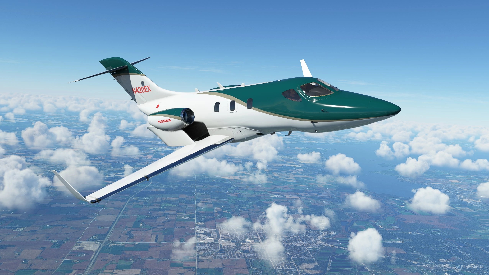</a> | [Hjet (Mg Flightfx)   Ice, Fuel And Trim Panel](./msfs2020/honda_hondajet_flightfx/ice_fuel_trim/hjet_(mg_flightfx)___ice,_fuel_and_trim_panel.siff) [Hjet (Mg Flightfx)   Landing Gear And Elt](./msfs2020/honda_hondajet_flightfx/landing_gear_and_elt/hjet_(mg_flightfx)___landing_gear_and_elt.siff) [Hjet (Mg Flightfx)   Afcs](./msfs2020/honda_hondajet_flightfx/afcs/hjet_(mg_flightfx)___afcs.siff) [Hjet (Mg Flightfx)   Afc Servo Power](./msfs2020/honda_hondajet_flightfx/afcs_servo/hjet_(mg_flightfx)___afc_servo_power.siff) [Hjet (Mg Flightfx)   Oxygen Controls](./msfs2020/honda_hondajet_flightfx/oxygen/hjet_(mg_flightfx)___oxygen_controls.siff) [Hjet (Mg Flightfx)   Fire Suppression](./msfs2020/honda_hondajet_flightfx/fire_suppression/hjet_(mg_flightfx)___fire_suppression.siff) [Hjet (Mg Flightfx)   Standby Flight Instrument Bezel Overlay](./msfs2020/honda_hondajet_flightfx/standy_flight_instrument/hjet_(mg_flightfx)___standby_flight_instrument_bezel_overlay.siff) [Hjet (Mg Flightfx)   Starter And Parking Brake](./msfs2020/honda_hondajet_flightfx/starter/hjet_(mg_flightfx)___starter_and_parking_brake.siff) [Hjet (Mg Flightfx)   Electrical Switch Panel](./msfs2020/honda_hondajet_flightfx/electrical_panel/hjet_(mg_flightfx)___electrical_switch_panel.siff) [Hjet (Mg Flightfx)   Master Alert Panel](./msfs2020/honda_hondajet_flightfx/master_alert/hjet_(mg_flightfx)___master_alert_panel.siff) |
| Mooney M20 Default | <a href="././msfs2020/mooney_m20_default/plane.png">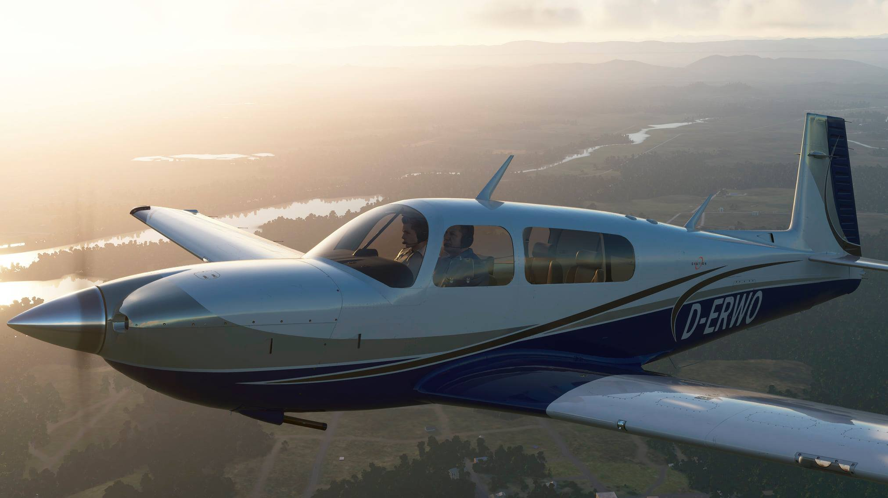</a> | [Mooney M20R   Switch Strip](./msfs2020/mooney_m20_default/mooneym20r_switch_strip/mooney_m20r___switch_strip.siff) [Mooney M20R   Fuel Selector Valve](./msfs2020/mooney_m20_default/mooney_m20r_fuel_selector/mooney_m20r___fuel_selector_valve.siff) [Mooneym20R Landing Gear Handle](./msfs2020/mooney_m20_default/mooneym20r_landing_gear_handle/mooneym20r_landing_gear_handle.siff) [Mooney M20R   Master Switches](./msfs2020/mooney_m20_default/mooneym20r_master_switches/mooney_m20r___master_switches.siff) [Mooney M20R Flap Position Indicator](./msfs2020/mooney_m20_default/mooney_m20r_flap_position_indicator/mooney_m20r_flap_position_indicator.siff) [Mooney M20R Elevator Trim Indicator](./msfs2020/mooney_m20_default/mooney_m20r_elevator_trim_indicator/mooney_m20r_elevator_trim_indicator.siff) [Mooney M20R   Light Swtich Panel](./msfs2020/mooney_m20_default/mooney_m20r_light_switch_panel/mooney_m20r___light_swtich_panel.siff) |
| Piper Arrow Iii Default | <a href="././msfs2020/piper_arrow_iii_default/plane.png">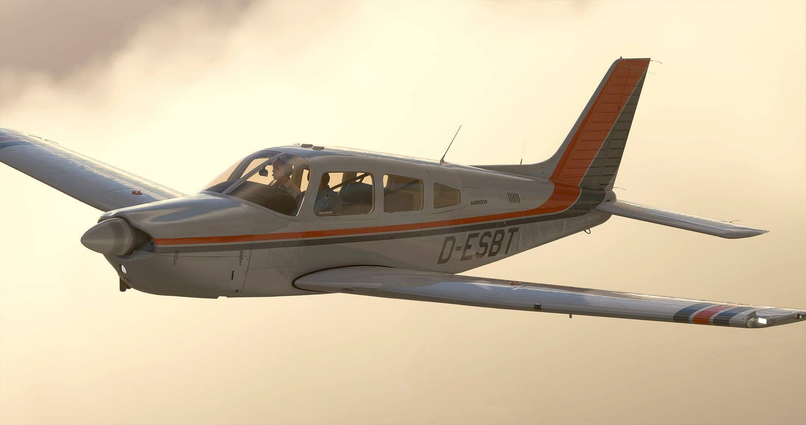</a> | [Piperpa28 Fuel Selector Valve](./msfs2020/piper_arrow_iii_default/fuel_selector_valve/piperpa28_fuel_selector_valve.siff) |
| Tbm 930 Default | <a href="././msfs2020/tbm_930_default/plane.png">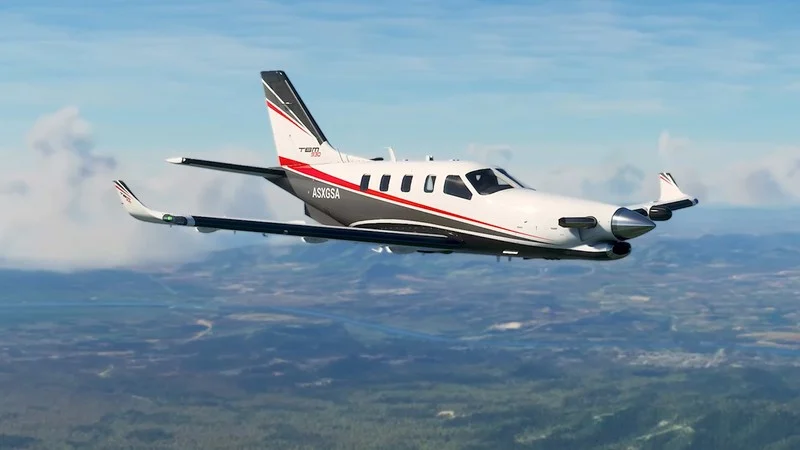</a> | [Tbm 930   Gtc 580 Overlay](./msfs2020/tbm_930_default/tbm_930_gtc_580_bezel/tbm_930___gtc_580_overlay.siff) [Tbm 930 Barometer Knob](./msfs2020/tbm_930_default/tbm_930_barometer_knob/tbm_930_barometer_knob.siff) [Tbm 930 Overhead Intlights](./msfs2020/tbm_930_default/tbm_930_overhead_intlights/tbm_930_overhead_intlights.siff) [Tbm 930 De Ice Panel](./msfs2020/tbm_930_default/tbm_930_de_ice_panel/tbm_930_de_ice_panel.siff) [Tbm 930 Overhead Extlights](./msfs2020/tbm_930_default/tbm_930_overhead_extlights/tbm_930_overhead_extlights.siff) [Tbm 930 Parking Brake](./msfs2020/tbm_930_default/tbm_930_parking_brake/tbm_930_parking_brake.siff) [Tbm 930 Overhead Electricpower](./msfs2020/tbm_930_default/tbm_930_overhead_electricpower/tbm_930_overhead_electricpower.siff) [Tbm 930 Overhead Enginestart+Fuel](./msfs2020/tbm_930_default/tbm_930_overhead_enginestart+fuel/tbm_930_overhead_enginestart+fuel.siff) [Tbm 930 Overhead Ap Trim](./msfs2020/tbm_930_default/tbm_930_overhead_ap_trim/tbm_930_overhead_ap_trim.siff) [Tbm 930 Pressurization Panel](./msfs2020/tbm_930_default/tbm_930_pressurization_panel/tbm_930_pressurization_panel.siff) [Tbm 930 Landing Gear Handle](./msfs2020/tbm_930_default/tbm_930_landing_gear_handle/tbm_930_landing_gear_handle.siff) |

---

Generated with ❤️.