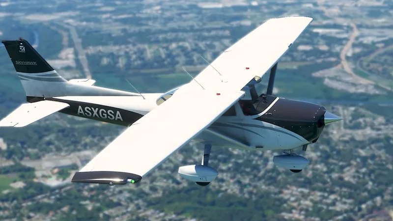

# Air Manager Panels for Microsoft Flight Simulator 2020 and 2024

We are a **fork** of [Simstrumentation](https://github.com/Simstrumentation/Air-Manager) as we update and add new instruments for both Microsoft Flight Simulator 2020 as well as 2024.

We are active on their [Discord](https://discord.gg/6xkCXe5pMn) if you have any questions!

## Submit your own instruments

[Click on our Google Form](https://forms.gle/6TeXh5Q3rHtmLRB87) to submit your own instruments.

We would be VERY happy to see your creations! Our script will automatically create a pull request and update the source code so any changes are seen publically.

## Important Notes

* Due to numerous issues with MSFS2024, we have all files in a separate folder. We will NOT provide panels which are compatible with both versions from one siff file. You must use the separate siff.
* If you experience any issues with an instrument, first check the `source` folder for the instrument. In the source code, find `logic.lua` and you'll see (usually at the top) comments with regards to the code.
## Microsoft Flight Simulator 2024

UNDER CONSTRUCTION! Please submit your panels!

## Microsoft Flight Simulator 2020

This section lists the aircraft and their available instruments.

| Name | Image | Instruments |
|------|-------|-------------|
| Airbus A320 Fenix |  | • [Mcdu](https://github.com/simpanels/air-manager/raw/refs/heads/main/msfs2020/airbus_a320_fenix/mcdu/mcdu.siff) |
| Airbus A320 Flybywire |  | • [Fms](https://github.com/simpanels/air-manager/raw/refs/heads/main/msfs2020/airbus_a320_flybywire/fms/fms.siff) |
| Beechcraft Bonanza Brsimdesigns |  | • [Fuel Selector Valve](https://github.com/simpanels/air-manager/raw/refs/heads/main/msfs2020/beechcraft_bonanza_brsimdesigns/fuel_selector_valve/fuel_selector_valve.siff) |
| Beechcraft Bonanza Default |  | • [Fuel Selector Valve](https://github.com/simpanels/air-manager/raw/refs/heads/main/msfs2020/beechcraft_bonanza_default/fuel_selector_valve/fuel_selector_valve.siff) • [Switch Panel](https://github.com/simpanels/air-manager/raw/refs/heads/main/msfs2020/beechcraft_bonanza_default/switch_panel/switch_panel.siff) |
| Bombardier Crj Default |  | • [Pedestal Eicas Panel](https://github.com/simpanels/air-manager/raw/refs/heads/main/msfs2020/bombardier_crj_default/pedestal_eicas_panel/pedestal_eicas_panel.siff) • [Pedestal Cargo Firex Panel](https://github.com/simpanels/air-manager/raw/refs/heads/main/msfs2020/bombardier_crj_default/pedestal_cargo_firex_panel/pedestal_cargo_firex_panel.siff) • [Pedestal Atc Transponder Panel](https://github.com/simpanels/air-manager/raw/refs/heads/main/msfs2020/bombardier_crj_default/pedestal_atc_transponder_panel/pedestal_atc_transponder_panel.siff) • [Overhead Apu Panel](https://github.com/simpanels/air-manager/raw/refs/heads/main/msfs2020/bombardier_crj_default/overhead_apu_panel/overhead_apu_panel.siff) • [Pedestal Lighting Control Panel](https://github.com/simpanels/air-manager/raw/refs/heads/main/msfs2020/bombardier_crj_default/pedestal_lighting_control_panel/pedestal_lighting_control_panel.siff) • [Pedestal Audio Control Panel](https://github.com/simpanels/air-manager/raw/refs/heads/main/msfs2020/bombardier_crj_default/pedestal_audio_control_panel/pedestal_audio_control_panel.siff) • [Parking Brake](https://github.com/simpanels/air-manager/raw/refs/heads/main/msfs2020/bombardier_crj_default/parking_brake/parking_brake.siff) • [Pedestal Fan Selector Panel](https://github.com/simpanels/air-manager/raw/refs/heads/main/msfs2020/bombardier_crj_default/pedestal_fan_selector_panel/pedestal_fan_selector_panel.siff) • [Landing Gear Control Panel](https://github.com/simpanels/air-manager/raw/refs/heads/main/msfs2020/bombardier_crj_default/landing_gear_control_panel/landing_gear_control_panel.siff) • [Pedestal Weather Radar System Panel](https://github.com/simpanels/air-manager/raw/refs/heads/main/msfs2020/bombardier_crj_default/pedestal_weather_radar_system_panel/pedestal_weather_radar_system_panel.siff) • [Pedestal Blank Panel](https://github.com/simpanels/air-manager/raw/refs/heads/main/msfs2020/bombardier_crj_default/pedestal_blank_panel/pedestal_blank_panel.siff) • [Pedestal Intercom Control Panel](https://github.com/simpanels/air-manager/raw/refs/heads/main/msfs2020/bombardier_crj_default/pedestal_intercom_control_panel/pedestal_intercom_control_panel.siff) • [Overhead Hydraulic Sov Panel](https://github.com/simpanels/air-manager/raw/refs/heads/main/msfs2020/bombardier_crj_default/overhead_hydraulic_sov_panel/overhead_hydraulic_sov_panel.siff) • [Overhead Ignition Panel](https://github.com/simpanels/air-manager/raw/refs/heads/main/msfs2020/bombardier_crj_default/overhead_ignition_panel/overhead_ignition_panel.siff) • [Pedestal Stabmach Trim Panel](https://github.com/simpanels/air-manager/raw/refs/heads/main/msfs2020/bombardier_crj_default/pedestal_stabmach_trim_panel/pedestal_stabmach_trim_panel.siff) • [Pedestal Source Selector Panel](https://github.com/simpanels/air-manager/raw/refs/heads/main/msfs2020/bombardier_crj_default/pedestal_source_selector_panel/pedestal_source_selector_panel.siff) • [Fms Mcdu Overlay](https://github.com/simpanels/air-manager/raw/refs/heads/main/msfs2020/bombardier_crj_default/fms_mcdu_overlay/fms_mcdu_overlay.siff) • [Overhead Bleed Air Panel](https://github.com/simpanels/air-manager/raw/refs/heads/main/msfs2020/bombardier_crj_default/overhead_bleed_air_panel/overhead_bleed_air_panel.siff) • [Overhead Anti Ice Panel](https://github.com/simpanels/air-manager/raw/refs/heads/main/msfs2020/bombardier_crj_default/overhead_anti_ice_panel/overhead_anti_ice_panel.siff) • [Overhead Landing Lights Panel](https://github.com/simpanels/air-manager/raw/refs/heads/main/msfs2020/bombardier_crj_default/overhead_landing_lights_panel/overhead_landing_lights_panel.siff) • [Warning Light Panel](https://github.com/simpanels/air-manager/raw/refs/heads/main/msfs2020/bombardier_crj_default/warning_light_panel/warning_light_panel.siff) • [Pedestal Aileron Rudder Trim Panel](https://github.com/simpanels/air-manager/raw/refs/heads/main/msfs2020/bombardier_crj_default/pedestal_aileron_rudder_trim_panel/pedestal_aileron_rudder_trim_panel.siff) • [Overhead Fire Test Panel](https://github.com/simpanels/air-manager/raw/refs/heads/main/msfs2020/bombardier_crj_default/overhead_fire_test_panel/overhead_fire_test_panel.siff) • [Pedestal Radio Tuning Unit](https://github.com/simpanels/air-manager/raw/refs/heads/main/msfs2020/bombardier_crj_default/pedestal_radio_tuning_unit/pedestal_radio_tuning_unit.siff) • [Engine Miscellaneous Test Panel](https://github.com/simpanels/air-manager/raw/refs/heads/main/msfs2020/bombardier_crj_default/engine_miscellaneous_test_panel/engine_miscellaneous_test_panel.siff) • [Overhead Cabin Pressure Panel](https://github.com/simpanels/air-manager/raw/refs/heads/main/msfs2020/bombardier_crj_default/overhead_cabin_press_panel/overhead_cabin_pressure_panel.siff) • [Overhead Hydraulic Switches Panel](https://github.com/simpanels/air-manager/raw/refs/heads/main/msfs2020/bombardier_crj_default/overhead_hydraulic_switches_panel/overhead_hydraulic_switches_panel.siff) • [Overhead Misc Lights Panel](https://github.com/simpanels/air-manager/raw/refs/heads/main/msfs2020/bombardier_crj_default/overhead_misc_lights_panel/overhead_misc_lights_panel.siff) • [Ground Proximity Warning Panel](https://github.com/simpanels/air-manager/raw/refs/heads/main/msfs2020/bombardier_crj_default/ground_proximity_warning_panel/ground_proximity_warning_panel.siff) • [Overhead Electrical Power Panel](https://github.com/simpanels/air-manager/raw/refs/heads/main/msfs2020/bombardier_crj_default/overhead_electrical_power_panel/overhead_electrical_power_panel.siff) • [Pedestal Flight Desk Door Panel](https://github.com/simpanels/air-manager/raw/refs/heads/main/msfs2020/bombardier_crj_default/pedestal_flight_desk_door_panel/pedestal_flight_desk_door_panel.siff) • [Bombardier  Overhead Pass Emer Lights And Elt Panel](https://github.com/simpanels/air-manager/raw/refs/heads/main/msfs2020/bombardier_crj_default/overhead_pass_&_emer_lights_and_elt_panel/bombardier__overhead_pass_emer_lights_and_elt_panel.siff) • [Pedestal Hgs Control Panel](https://github.com/simpanels/air-manager/raw/refs/heads/main/msfs2020/bombardier_crj_default/pedestal_hgs_control_panel/pedestal_hgs_control_panel.siff) • [Spoilers Switch Panel](https://github.com/simpanels/air-manager/raw/refs/heads/main/msfs2020/bombardier_crj_default/spoilers_switch_panel/spoilers_switch_panel.siff) • [Autopilot](https://github.com/simpanels/air-manager/raw/refs/heads/main/msfs2020/bombardier_crj_default/afcs_autopilot/autopilot.siff) • [Overhead Air Conditioning Panel](https://github.com/simpanels/air-manager/raw/refs/heads/main/msfs2020/bombardier_crj_default/overhead_air_conditioning_panel/overhead_air_conditioning_panel.siff) • [Pedestal Irs Mode Panel](https://github.com/simpanels/air-manager/raw/refs/heads/main/msfs2020/bombardier_crj_default/pedestal_irs_mode_panel/pedestal_irs_mode_panel.siff) • [Pdf Mdf Overlay Bezel](https://github.com/simpanels/air-manager/raw/refs/heads/main/msfs2020/bombardier_crj_default/pfd_mfd_overlay_bezel/pdf_mdf_overlay_bezel.siff) • [Side Panel](https://github.com/simpanels/air-manager/raw/refs/heads/main/msfs2020/bombardier_crj_default/side_panel/side_panel.siff) • [Overhead External Lights Panel](https://github.com/simpanels/air-manager/raw/refs/heads/main/msfs2020/bombardier_crj_default/overhead_external_light_panel/overhead_external_lights_panel.siff) • [Pedestal Yaw Damper Panel](https://github.com/simpanels/air-manager/raw/refs/heads/main/msfs2020/bombardier_crj_default/pedestal_yaw_damper_panel/pedestal_yaw_damper_panel.siff) • [Overhead Fuel Panel](https://github.com/simpanels/air-manager/raw/refs/heads/main/msfs2020/bombardier_crj_default/overhead_fuel_panel/overhead_fuel_panel.siff) |
| Cessna 152 Default |  | • [C152   Caburator Heat](https://github.com/simpanels/air-manager/raw/refs/heads/main/msfs2020/cessna_152_default/carb_heat/c152___caburator_heat.siff) • [Cessna 152 Fuel Valve](https://github.com/simpanels/air-manager/raw/refs/heads/main/msfs2020/cessna_152_default/fuel_valve/cessna_152_fuel_valve.siff) • [Cessna 152 Primer Handle](https://github.com/simpanels/air-manager/raw/refs/heads/main/msfs2020/cessna_152_default/primer_handle/cessna_152_primer_handle.siff) |
| Cessna 172 Default |  | • [Cessna 172 G1000   Switch Panel ](https://github.com/simpanels/air-manager/raw/refs/heads/main/msfs2020/cessna_172_default/g1000_switch_panel/cessna_172_g1000___switch_panel_.siff) • [Cessna 172 Alternate Static Air](https://github.com/simpanels/air-manager/raw/refs/heads/main/msfs2020/cessna_172_default/alternate_static_air/cessna_172_alternate_static_air.siff) • [Cessna 172   Fuel Cutoff](https://github.com/simpanels/air-manager/raw/refs/heads/main/msfs2020/cessna_172_default/cutoff_valve/cessna_172___fuel_cutoff.siff) |
| Cessna 310 Milviz |  | • [Fuel Quantity Gauge](https://github.com/simpanels/air-manager/raw/refs/heads/main/msfs2020/cessna_310_milviz/fuel_gauge/fuel_quantity_gauge.siff) • [Heat And Cabin Air](https://github.com/simpanels/air-manager/raw/refs/heads/main/msfs2020/cessna_310_milviz/heat_and_cabin_air/heat_and_cabin_air.siff) • [Fuel Selector](https://github.com/simpanels/air-manager/raw/refs/heads/main/msfs2020/cessna_310_milviz/fuel_selector/fuel_selector.siff) • [Edm Overlay](https://github.com/simpanels/air-manager/raw/refs/heads/main/msfs2020/cessna_310_milviz/edm/edm_overlay.siff) • [Light And De Ice Switch Panel](https://github.com/simpanels/air-manager/raw/refs/heads/main/msfs2020/cessna_310_milviz/deice_and_exterior_light_panel/light_and_de_ice_switch_panel.siff) • [Fuel Flow Meter](https://github.com/simpanels/air-manager/raw/refs/heads/main/msfs2020/cessna_310_milviz/fuel_flow_meter/fuel_flow_meter.siff) • [Main Switch Panel](https://github.com/simpanels/air-manager/raw/refs/heads/main/msfs2020/cessna_310_milviz/electrical_panel/main_switch_panel.siff) |
| Cessna 414 Flysimware |  | • [Exhaust Gas Temperature Gauge](https://github.com/simpanels/air-manager/raw/refs/heads/main/msfs2020/cessna_414_flysimware/egt/exhaust_gas_temperature_gauge.siff) • [Fuel Quantity Gauge](https://github.com/simpanels/air-manager/raw/refs/heads/main/msfs2020/cessna_414_flysimware/fuel_quantity/fuel_quantity_gauge.siff) • [Cabin Differential Pressure](https://github.com/simpanels/air-manager/raw/refs/heads/main/msfs2020/cessna_414_flysimware/cabin_differential_pressure/cabin_differential_pressure.siff) • [Radar Altimeter](https://github.com/simpanels/air-manager/raw/refs/heads/main/msfs2020/cessna_414_flysimware/radar_alt/radar_altimeter.siff) • [Digital Altitude Alerter](https://github.com/simpanels/air-manager/raw/refs/heads/main/msfs2020/cessna_414_flysimware/digital_altitude_alerter/digital_altitude_alerter.siff) • [Climate Control   Air Conditioning](https://github.com/simpanels/air-manager/raw/refs/heads/main/msfs2020/cessna_414_flysimware/climate_control_air_conditioner/climate_control___air_conditioning.siff) • [Cowl Flaps](https://github.com/simpanels/air-manager/raw/refs/heads/main/msfs2020/cessna_414_flysimware/cowl_flaps/cowl_flaps.siff) • [Altimeter ](https://github.com/simpanels/air-manager/raw/refs/heads/main/msfs2020/cessna_414_flysimware/altimeter/altimeter_.siff) • [Vertical Speed Indicator ](https://github.com/simpanels/air-manager/raw/refs/heads/main/msfs2020/cessna_414_flysimware/vsi/vertical_speed_indicator_.siff) • [Aileron Trim](https://github.com/simpanels/air-manager/raw/refs/heads/main/msfs2020/cessna_414_flysimware/aileron_trim/aileron_trim.siff) • [Fuel Selector](https://github.com/simpanels/air-manager/raw/refs/heads/main/msfs2020/cessna_414_flysimware/fuel_selector_valves/fuel_selector.siff) • [Cabin Pressurization Control](https://github.com/simpanels/air-manager/raw/refs/heads/main/msfs2020/cessna_414_flysimware/cabin_pressure_control/cabin_pressurization_control.siff) • [Turn And Slip Coordinator](https://github.com/simpanels/air-manager/raw/refs/heads/main/msfs2020/cessna_414_flysimware/turn/turn_and_slip_coordinator.siff) • [Interior Light Panel](https://github.com/simpanels/air-manager/raw/refs/heads/main/msfs2020/cessna_414_flysimware/interior_lighting/interior_light_panel.siff) • [Suction Gauge](https://github.com/simpanels/air-manager/raw/refs/heads/main/msfs2020/cessna_414_flysimware/suction/suction_gauge.siff) • [Manifold Pressure Gauge](https://github.com/simpanels/air-manager/raw/refs/heads/main/msfs2020/cessna_414_flysimware/manifold/manifold_pressure_gauge.siff) • [Oat Gauge](https://github.com/simpanels/air-manager/raw/refs/heads/main/msfs2020/cessna_414_flysimware/oat/oat_gauge.siff) • [Garmin Gfc 600 Overlay](https://github.com/simpanels/air-manager/raw/refs/heads/main/msfs2020/cessna_414_flysimware/gfc_600/garmin_gfc_600_overlay.siff) • [Altitude Alerter](https://github.com/simpanels/air-manager/raw/refs/heads/main/msfs2020/cessna_414_flysimware/altitude_alerter/altitude_alerter.siff) • [Annunciator Panel](https://github.com/simpanels/air-manager/raw/refs/heads/main/msfs2020/cessna_414_flysimware/annunciator_panel/annunciator_panel.siff) • [Cabin Pressure Switch](https://github.com/simpanels/air-manager/raw/refs/heads/main/msfs2020/cessna_414_flysimware/cabin_pressure_switch/cabin_pressure_switch.siff) • [Climate Control   Heating](https://github.com/simpanels/air-manager/raw/refs/heads/main/msfs2020/cessna_414_flysimware/climate_control_heater/climate_control___heating.siff) • [Switch Panel](https://github.com/simpanels/air-manager/raw/refs/heads/main/msfs2020/cessna_414_flysimware/switch_panel/switch_panel.siff) • [Cabin Pressurization Rate](https://github.com/simpanels/air-manager/raw/refs/heads/main/msfs2020/cessna_414_flysimware/cabin_rate/cabin_pressurization_rate.siff) • [Pressure Dump And Oxygen Levers](https://github.com/simpanels/air-manager/raw/refs/heads/main/msfs2020/cessna_414_flysimware/pressure_dump/pressure_dump_and_oxygen_levers.siff) • [Rpm Gauge](https://github.com/simpanels/air-manager/raw/refs/heads/main/msfs2020/cessna_414_flysimware/rpm/rpm_gauge.siff) • [Airspeed Indicator](https://github.com/simpanels/air-manager/raw/refs/heads/main/msfs2020/cessna_414_flysimware/airspeed_indicator/airspeed_indicator.siff) • [Cabin Oxygen Capacity](https://github.com/simpanels/air-manager/raw/refs/heads/main/msfs2020/cessna_414_flysimware/cabin_oxygen_capacity/cabin_oxygen_capacity.siff) • [Triple Gauge](https://github.com/simpanels/air-manager/raw/refs/heads/main/msfs2020/cessna_414_flysimware/triple/triple_gauge.siff) |
| Cessna Citation Cj4 |  | • [Audio Panel](https://github.com/simpanels/air-manager/raw/refs/heads/main/msfs2020/cessna_citation_cj4/cj4_audio_panel/audio_panel.siff) • [Climate Control Knob](https://github.com/simpanels/air-manager/raw/refs/heads/main/msfs2020/cessna_citation_cj4/cj4_climate_control_knob/climate_control_knob.siff) • [Standby Flight Instrument Overlay](https://github.com/simpanels/air-manager/raw/refs/heads/main/msfs2020/cessna_citation_cj4/cj4_standby_flight_instrument/standby_flight_instrument_overlay.siff) • [Lower Ccp Panel](https://github.com/simpanels/air-manager/raw/refs/heads/main/msfs2020/cessna_citation_cj4/cj4_lower_ccp_panel/lower_ccp_panel.siff) • [Pfd Mfd Overlay](https://github.com/simpanels/air-manager/raw/refs/heads/main/msfs2020/cessna_citation_cj4/cj4_pfd_mfd_overlay/pfd_mfd_overlay.siff) • [Autopilot Panel](https://github.com/simpanels/air-manager/raw/refs/heads/main/msfs2020/cessna_citation_cj4/cj4_autopilot_panel/autopilot_panel.siff) • [Light Panel](https://github.com/simpanels/air-manager/raw/refs/heads/main/msfs2020/cessna_citation_cj4/cj4_light_panel/light_panel.siff) • [Landing Gear Handle](https://github.com/simpanels/air-manager/raw/refs/heads/main/msfs2020/cessna_citation_cj4/cj4_landing_gear_handle/landing_gear_handle.siff) • [Ice Protection Panel](https://github.com/simpanels/air-manager/raw/refs/heads/main/msfs2020/cessna_citation_cj4/cj4_ice_protection_panel/ice_protection_panel.siff) • [Fuel Transfer Knob](https://github.com/simpanels/air-manager/raw/refs/heads/main/msfs2020/cessna_citation_cj4/cj4_fuel_transfer_knob/fuel_transfer_knob.siff) • [Parking Brake](https://github.com/simpanels/air-manager/raw/refs/heads/main/msfs2020/cessna_citation_cj4/cj4_parking_brake/parking_brake.siff) • [Electrical Panel](https://github.com/simpanels/air-manager/raw/refs/heads/main/msfs2020/cessna_citation_cj4/cj4_electrical_panel/electrical_panel.siff) • [Master Caution And Warning](https://github.com/simpanels/air-manager/raw/refs/heads/main/msfs2020/cessna_citation_cj4/cj4_master_caution_warning/master_caution_and_warning.siff) • [Cockpit Lights](https://github.com/simpanels/air-manager/raw/refs/heads/main/msfs2020/cessna_citation_cj4/cj4_cockpit_lights/cockpit_lights.siff) • [Rockwell Collins Pro Line 21 Fms Mcdu Overlay](https://github.com/simpanels/air-manager/raw/refs/heads/main/msfs2020/cessna_citation_cj4/cj4_rockwell_collins_pro_line_21/rockwell_collins_pro_line_21_fms_mcdu_overlay.siff) • [Upper Dcp Menu](https://github.com/simpanels/air-manager/raw/refs/heads/main/msfs2020/cessna_citation_cj4/cj4_upper_dcp_panel/upper_dcp_menu.siff) • [Trim And Engine Control Panel](https://github.com/simpanels/air-manager/raw/refs/heads/main/msfs2020/cessna_citation_cj4/cj4_trim_and_engine_control/trim_and_engine_control_panel.siff) |
| Cirrus Sr22 Default |  | • [Switch Panel](https://github.com/simpanels/air-manager/raw/refs/heads/main/msfs2020/cirrus_sr22_default/switch_panel/switch_panel.siff) |
| Cirrus Visionjet Flightfx |  | • [Fuel Selector](https://github.com/simpanels/air-manager/raw/refs/heads/main/msfs2020/cirrus_visionjet_flightfx/fuel_selector/fuel_selector.siff) • [Evironmental Control System](https://github.com/simpanels/air-manager/raw/refs/heads/main/msfs2020/cirrus_visionjet_flightfx/ecs/evironmental_control_system.siff) • [Flap Actuator](https://github.com/simpanels/air-manager/raw/refs/heads/main/msfs2020/cirrus_visionjet_flightfx/flap_actuator/flap_actuator.siff) • [Landing Gear Panel](https://github.com/simpanels/air-manager/raw/refs/heads/main/msfs2020/cirrus_visionjet_flightfx/landing_gear/landing_gear_panel.siff) • [Start Controls](https://github.com/simpanels/air-manager/raw/refs/heads/main/msfs2020/cirrus_visionjet_flightfx/start_control/start_controls.siff) • [Auto Throttle](https://github.com/simpanels/air-manager/raw/refs/heads/main/msfs2020/cirrus_visionjet_flightfx/auto_throttle/auto_throttle.siff) • [Switch Panel ](https://github.com/simpanels/air-manager/raw/refs/heads/main/msfs2020/cirrus_visionjet_flightfx/switch_panel/switch_panel_.siff) |
| Daher Kodiak Simworks |  | • [Light And Ice Switch Panel](https://github.com/simpanels/air-manager/raw/refs/heads/main/msfs2020/daher_kodiak_simworks/dakher_kodiak_light_and_ice_panel/light_and_ice_switch_panel.siff) • [Rudder Trim Switch](https://github.com/simpanels/air-manager/raw/refs/heads/main/msfs2020/daher_kodiak_simworks/daher_kodiak_rudder_trim_switch/rudder_trim_switch.siff) • [Fuel Valves](https://github.com/simpanels/air-manager/raw/refs/heads/main/msfs2020/daher_kodiak_simworks/daher_kodiak_fuel_valves/fuel_valves.siff) • [Oxygen Control Panel](https://github.com/simpanels/air-manager/raw/refs/heads/main/msfs2020/daher_kodiak_simworks/daher_kodiak_oxygen_control/oxygen_control_panel.siff) • [Switch Panel](https://github.com/simpanels/air-manager/raw/refs/heads/main/msfs2020/daher_kodiak_simworks/dakher_kodiak_switch_panel/switch_panel.siff) • [Shoulder Harness Reel Lock Lever](https://github.com/simpanels/air-manager/raw/refs/heads/main/msfs2020/daher_kodiak_simworks/daher_kodiak_shoulder_harness_lock_lever/shoulder_harness_reel_lock_lever.siff) |
| Generic |  | • [Gtc 570 Bezel Overlay](https://github.com/simpanels/air-manager/raw/refs/heads/main/msfs2020/generic/generic_garmin_gtc570/gtc_570_bezel_overlay.siff) • [Hobbs Meter](https://github.com/simpanels/air-manager/raw/refs/heads/main/msfs2020/generic/generic_hobbs_meter/hobbs_meter.siff) • [Garmin Gmc 710](https://github.com/simpanels/air-manager/raw/refs/heads/main/msfs2020/generic/generic_garmin_gmc_710/garmin_gmc_710.siff) • [Garmin Gfc 500 Autopilot ](https://github.com/simpanels/air-manager/raw/refs/heads/main/msfs2020/generic/generic_gfc500/garmin_gfc_500_autopilot_.siff) • [Tdi Simulations Garmin Gtnxi 650 Overlay](https://github.com/simpanels/air-manager/raw/refs/heads/main/msfs2020/generic/generic_tds_gtnxi_650/tdi_simulations_garmin_gtnxi_650_overlay.siff) • [Pms50 Gtn650 Overlay](https://github.com/simpanels/air-manager/raw/refs/heads/main/msfs2020/generic/generic_pms50_gtn650/pms50_gtn650_overlay.siff) • [Ground Power Unit Knob](https://github.com/simpanels/air-manager/raw/refs/heads/main/msfs2020/generic/generic_gpu_knob/ground_power_unit_knob.siff) • [Garmin G1000 Nxi](https://github.com/simpanels/air-manager/raw/refs/heads/main/msfs2020/generic/generic_garmin_g1000_nxi/garmin_g1000_nxi.siff) • [Gtc 580 Overlay](https://github.com/simpanels/air-manager/raw/refs/heads/main/msfs2020/generic/generic_garmin_gtc580/gtc_580_overlay.siff) • [Garmin Gma 1347 Audio Panel (Msfs)](https://github.com/simpanels/air-manager/raw/refs/heads/main/msfs2020/generic/generic_garmin_gma_1347_audio_panel/garmin_gma_1347_audio_panel_(msfs).siff) • [Garmin G3X Pfd Mdf Overlay ](https://github.com/simpanels/air-manager/raw/refs/heads/main/msfs2020/generic/generic_garmin_g3x/garmin_g3x_pfd_mdf_overlay_.siff) • [Garmin G3000   5000  Pfd Mfd Bezel Overlay](https://github.com/simpanels/air-manager/raw/refs/heads/main/msfs2020/generic/generic_garmin_g3000_5000_bezel/garmin_g3000___5000__pfd_mfd_bezel_overlay.siff) • [Pms50 Garmin Gtn750 Overlay](https://github.com/simpanels/air-manager/raw/refs/heads/main/msfs2020/generic/generic_pms50_gtn750/pms50_garmin_gtn750_overlay.siff) • [Tds Simulations Garmin Gtnxi 750 Overlay](https://github.com/simpanels/air-manager/raw/refs/heads/main/msfs2020/generic/generic_tds_gtnxi_750/tds_simulations_garmin_gtnxi_750_overlay.siff) |
| Honda Hondajet Flightfx |  | • [Ice, Fuel And Trim Panel](https://github.com/simpanels/air-manager/raw/refs/heads/main/msfs2020/honda_hondajet_flightfx/ice_fuel_trim/ice,_fuel_and_trim_panel.siff) • [Landing Gear And Elt](https://github.com/simpanels/air-manager/raw/refs/heads/main/msfs2020/honda_hondajet_flightfx/landing_gear_and_elt/landing_gear_and_elt.siff) • [Afcs](https://github.com/simpanels/air-manager/raw/refs/heads/main/msfs2020/honda_hondajet_flightfx/afcs/afcs.siff) • [Afc Servo Power](https://github.com/simpanels/air-manager/raw/refs/heads/main/msfs2020/honda_hondajet_flightfx/afcs_servo/afc_servo_power.siff) • [Oxygen Controls](https://github.com/simpanels/air-manager/raw/refs/heads/main/msfs2020/honda_hondajet_flightfx/oxygen/oxygen_controls.siff) • [Fire Suppression](https://github.com/simpanels/air-manager/raw/refs/heads/main/msfs2020/honda_hondajet_flightfx/fire_suppression/fire_suppression.siff) • [Standby Flight Instrument Bezel Overlay](https://github.com/simpanels/air-manager/raw/refs/heads/main/msfs2020/honda_hondajet_flightfx/standy_flight_instrument/standby_flight_instrument_bezel_overlay.siff) • [Starter And Parking Brake](https://github.com/simpanels/air-manager/raw/refs/heads/main/msfs2020/honda_hondajet_flightfx/starter/starter_and_parking_brake.siff) • [Electrical Switch Panel](https://github.com/simpanels/air-manager/raw/refs/heads/main/msfs2020/honda_hondajet_flightfx/electrical_panel/electrical_switch_panel.siff) • [Master Alert Panel](https://github.com/simpanels/air-manager/raw/refs/heads/main/msfs2020/honda_hondajet_flightfx/master_alert/master_alert_panel.siff) |
| Mooney M20 Default |  | • [Switch Strip](https://github.com/simpanels/air-manager/raw/refs/heads/main/msfs2020/mooney_m20_default/mooneym20r_switch_strip/switch_strip.siff) • [Fuel Selector Valve](https://github.com/simpanels/air-manager/raw/refs/heads/main/msfs2020/mooney_m20_default/mooney_m20r_fuel_selector/fuel_selector_valve.siff) • [Landing Gear Handle](https://github.com/simpanels/air-manager/raw/refs/heads/main/msfs2020/mooney_m20_default/mooneym20r_landing_gear_handle/landing_gear_handle.siff) • [Master Switches](https://github.com/simpanels/air-manager/raw/refs/heads/main/msfs2020/mooney_m20_default/mooneym20r_master_switches/master_switches.siff) • [Flap Position Indicator](https://github.com/simpanels/air-manager/raw/refs/heads/main/msfs2020/mooney_m20_default/mooney_m20r_flap_position_indicator/flap_position_indicator.siff) • [Elevator Trim Indicator](https://github.com/simpanels/air-manager/raw/refs/heads/main/msfs2020/mooney_m20_default/mooney_m20r_elevator_trim_indicator/elevator_trim_indicator.siff) • [Light Swtich Panel](https://github.com/simpanels/air-manager/raw/refs/heads/main/msfs2020/mooney_m20_default/mooney_m20r_light_switch_panel/light_swtich_panel.siff) |
| Piper Arrow Iii Default |  | • [Fuel Selector Valve](https://github.com/simpanels/air-manager/raw/refs/heads/main/msfs2020/piper_arrow_iii_default/fuel_selector_valve/fuel_selector_valve.siff) |
| Tbm 930 Default |  | • [Gtc 580 Overlay](https://github.com/simpanels/air-manager/raw/refs/heads/main/msfs2020/tbm_930_default/tbm_930_gtc_580_bezel/gtc_580_overlay.siff) • [Barometer Knob](https://github.com/simpanels/air-manager/raw/refs/heads/main/msfs2020/tbm_930_default/tbm_930_barometer_knob/barometer_knob.siff) • [Overhead Intlights](https://github.com/simpanels/air-manager/raw/refs/heads/main/msfs2020/tbm_930_default/tbm_930_overhead_intlights/overhead_intlights.siff) • [De Ice Panel](https://github.com/simpanels/air-manager/raw/refs/heads/main/msfs2020/tbm_930_default/tbm_930_de_ice_panel/de_ice_panel.siff) • [Overhead Extlights](https://github.com/simpanels/air-manager/raw/refs/heads/main/msfs2020/tbm_930_default/tbm_930_overhead_extlights/overhead_extlights.siff) • [Parking Brake](https://github.com/simpanels/air-manager/raw/refs/heads/main/msfs2020/tbm_930_default/tbm_930_parking_brake/parking_brake.siff) • [Overhead Electricpower](https://github.com/simpanels/air-manager/raw/refs/heads/main/msfs2020/tbm_930_default/tbm_930_overhead_electricpower/overhead_electricpower.siff) • [Overhead Enginestart+Fuel](https://github.com/simpanels/air-manager/raw/refs/heads/main/msfs2020/tbm_930_default/tbm_930_overhead_enginestart+fuel/overhead_enginestart+fuel.siff) • [Overhead Ap Trim](https://github.com/simpanels/air-manager/raw/refs/heads/main/msfs2020/tbm_930_default/tbm_930_overhead_ap_trim/overhead_ap_trim.siff) • [Pressurization Panel](https://github.com/simpanels/air-manager/raw/refs/heads/main/msfs2020/tbm_930_default/tbm_930_pressurization_panel/pressurization_panel.siff) • [Landing Gear Handle](https://github.com/simpanels/air-manager/raw/refs/heads/main/msfs2020/tbm_930_default/tbm_930_landing_gear_handle/landing_gear_handle.siff) |

---

README automatically generated with ❤️ (see readme.py).